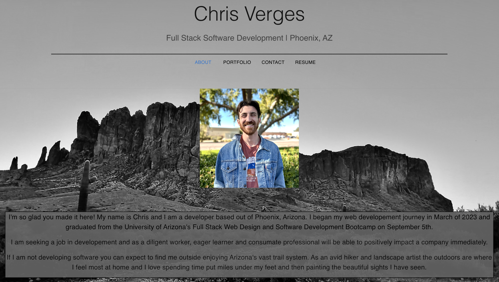
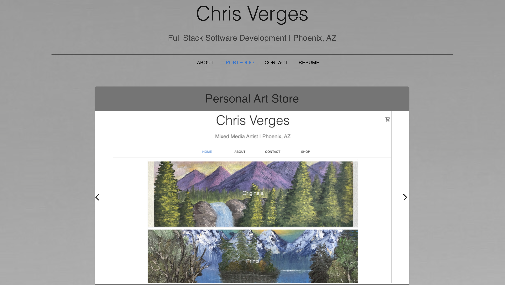
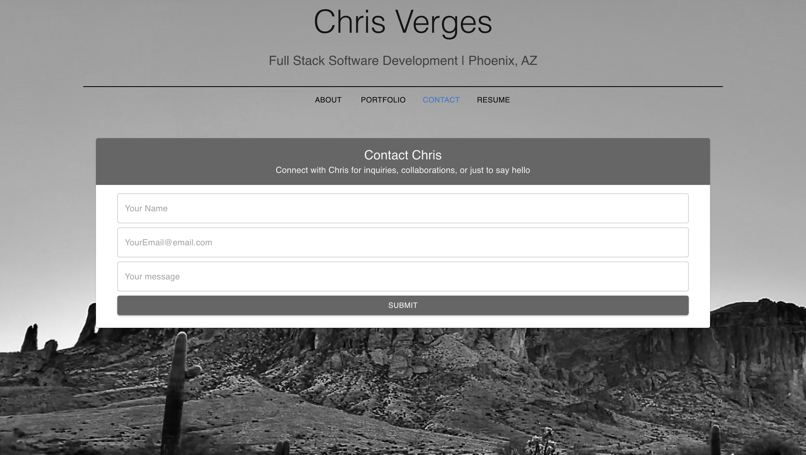

# Chris Verges Portfolio v3

## Licensing: MIT 

## Description

This application was created to serve as my personal portfolio so that I can display my professional work. The motivation for creating this portfolio was to have a central hub that potential employeers can visit to learn about myself and my work.

## Table of Contents

-[Website Screenshots](#website-screenshots)-[Installation](#installation) -[Usage](#usage) -[Credits](#credits) -[License](#license)

## Website Screenshots

## Installation

To view the source code for this project visit: https://github.com/cverges1/portfolio-v3

## Usage

Head to https://cverges1.github.io/portfolio-v3/ to find out more about myself and my work or to connect.

## Credits

- Collaborators: N/A
- Third Party Assets: React.js, Email.js, Github Pages, and MUI

## Questions

To contact me with additional questions:

- Github: cverges1
- Email: vergeschris@gmail.com
